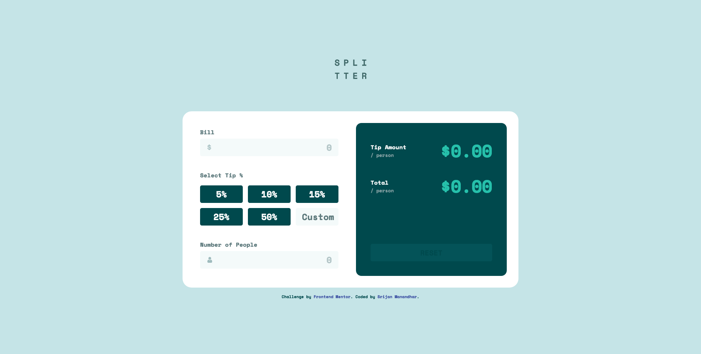
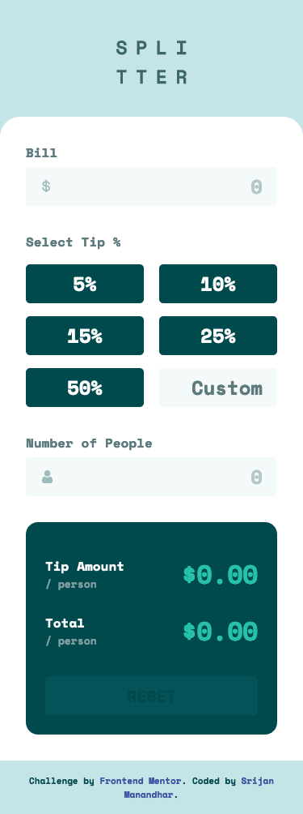

# Frontend Mentor - Tip calculator app solution

This is a solution to the [Tip calculator app challenge on Frontend Mentor](https://www.frontendmentor.io/challenges/tip-calculator-app-ugJNGbJUX). Frontend Mentor challenges help you improve your coding skills by building realistic projects.

## Table of contents

- [Overview](#overview)
  - [The challenge](#the-challenge)
  - [Screenshot](#screenshot)
  - [Links](#links)
- [My process](#my-process)
  - [Built with](#built-with)
  - [What I learned](#what-i-learned)
- [Author](#author)

## Overview

### The challenge

Users should be able to:

- View the optimal layout for the app depending on their device's screen size
- See hover states for all interactive elements on the page
- Calculate the correct tip and total cost of the bill per person

### Screenshot




### Links

- Solution URL: [https://github.com/srijanss/tip-calculator-app](https://github.com/srijanss/tip-calculator-app)
- Live Site URL: [https://srijanss.github.io/tip-calculator-app/](https://srijanss.github.io/tip-calculator-app/)

## My process

### Built with

- Semantic HTML5 markup
- CSS custom properties
- Flexbox
- Mobile-first workflow
- [Vite](https://vitejs.dev/) - Lightweight frontend tooling
- [PostCSS](https://postcss.org/) - Tool to transform CSS using plugins

### What I learned

```html
<section is="tip-calculator" class="container"></section>
```

Used customized built in elements. Created TipCalculator custom web components using section built it element.

```js
export default class Validator {
  constructor(inputEl) {
    this.inputEl = inputEl;
  }

  validate() {
    if (this.inputEl.type === "number") {
      return this.validateNumberInput();
    }
  }
```

Created separate module for validation of form that takes input element and checks the validation based on the added attributes.

I had issue with the button getting selected when Enter is pressed on input element after input value. This is normal form behaviour, when Enter key is pressed the first button on the form gets selected. To get around this issue I had to add keydown event on all the input element on the form and prevent default behaviour on Enter key press.

## Author

- Website - [Srijan Manandhar](https://github.com/srijanss)
- Frontend Mentor - [@srijanss](https://www.frontendmentor.io/profile/srijanss)
